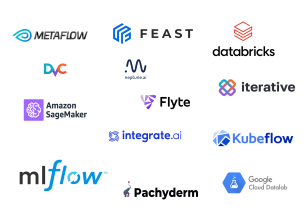

<!-- _class: lead 
_backgroundColor: #4527a4;
-->

---

## Problem 1

### Traditional AI includes all knowledge *in* the model

This is contrary to human intelligence, which incorporates external knowledge, and uses fluid intelligence to make inferences based on this external knowledge

---

## Problem 2

### MLops is highly fragmented

- Training AI and going to production is hard
- MLops has produced a plethora of tools which solve sub-problems of production
- Tools are piecemeal, and exaggerate the significance of pseudo-issues

---

## Problem 3

### There is very little tooling which unifies *databases* and *deep learning*

Traditional workflow is:

- Dump all data out of the database
- Train the model
- Throw away the data
- Deploy the model

---

## Solution

### SuperDuperDB

$$AI = knowledge + deep learning$$

- Intelligent design decisions based on best in class database and deep learning solutions
- PyTorch + MongoDB connector

---

## The idea

---

## Design decisions

### PyTorch is the most popular AI framework among experts

(Source: [horace.io](http://horace.io/pytorch-vs-tensorflow/))

| Rank | Percentage Papers | Framework  |
| ---- | ----------------- | ---------- |
| 1.   | 84%               | PyTorch    |
| 2.   | 16%               | Tensorflow |

---

## Design decisions

### MongoDB is the most popular document store in use today

(Source: [db-engines.com](https://db-engines.com/en/ranking/document+store))

| Rank | Database                  | Score |
| ---- | ------------------------- | ----- |
| 1.   | MongoDB                   | 486   |
| 2.   | Amazon DynamoDB           | 88    |
| 3.   | Databricks                | 58    |
| 4.   | Microsoft Azure Cosmos DB | 40    |

---

## Design decisions

### Experience building agile AI in Academia, Zalando, LF1 and Attraqt

PyTorch together with MongoDB allow for deep learning built ***with ease on a shoestring***.

Developers ***love*** these tools ***passionately***.

---

## Idea

### SuperDuperDB is *the* key ingredient

Allowing PyTorch AI models to interoperate directly with MongoDB

---

## The founder

### Duncan Blythe

- Graduated first in class Oxford Mathematics 2007
- MMathPhil, MSc, PhD
- 1,000s citations on published top AI research
- 10,000s of stars on GitHub open source
- Exited AlephSearch (bootstrapped) 2020 with team of 2 for mid 7-figure
- Gamut of technical skills: deep learning, software development, infrastructure, management, lean startup

---

## Progress

---

## Business models

---

## Market

### 2018

---

## Market

### 2023 onwards

---

## Market

### 2023 onwards

---

## Market

### 2023 onwards

---

## Market

### Databases

A huge market with unprecedented growth (source: [gartner.com](https://blogs.gartner.com/merv-adrian/2022/04/16/dbms-market-transformation-2021-the-big-picture/))

| Year | Market Size ($) |
| ---  | ---             |
| 2022 | 80 Billion      |
| 2020 | 65 Billion      |
| 2017 | 39 Billion      |

---

## Market

### AI software

A burgeoning new market already with huge reach (source: [gartner.com](https://www.gartner.com/en/newsroom/press-releases/2021-11-22-gartner-forecasts-worldwide-artificial-intelligence-software-market-to-reach-62-billion-in-2022))

| Year | Market Size ($) |
| ---  | ---             |
| 2022 | 63 Billion      |
| 2021 | 52 Billion      |

---

## Timeline

---

## Growth schedule

[Numbers of employees etc.]